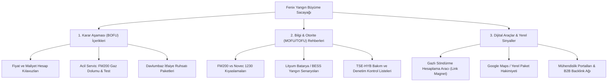
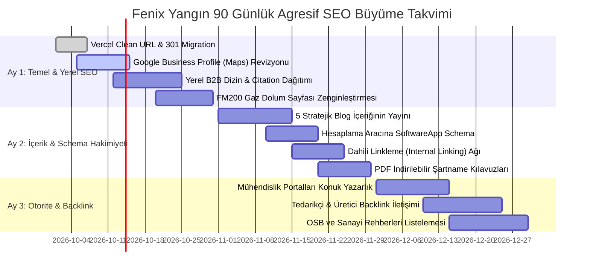

# FENİX YANGIN — SEO REKABET, İÇERİK BOŞLUĞU (CONTENT GAP) VE BÜYÜME STRATEJİSİ

**Hedef:** fenixyangin.com.tr'nin Türkiye yangın söndürme ve yangın güvenliği mühendisliği pazarında organik arama liderliğine (Search Authority) taşınması, ticari arama niyetlerinin (Commercial/Transactional Intent) domine edilmesi ve sıcak müşteri adaylarının (B2B Leads) artırılması.  
**Tarih:** 27 Eylül 2026  
**Doküman Kapsamı:** Anahtar Kelime Haritası, Sektörel İçerik Boşlukları, 5 Çarpıcı Blog Kurgusu, 3 Aylık Agresif SEO Yol Haritası.  
**Rol:** Kıdemli B2B SEO Stratejisti & Teknik İçerik Mimarı  

---

## YÖNETİCİ ÖZETİ (EXECUTIVE SUMMARY)

Yangın söndürme sistemleri sektörü; B2B satın alma döngüsünün uzun olduğu, teknik şartnamelerin, can güvenliğinin ve yasal zorunlulukların (Binaların Yangından Korunması Hakkında Yönetmelik - BYKHY, NFPA, TSE) karar süreçlerini belirlediği yüksek katma değerli bir alandır.

Fenix Yangın (`fenixyangin.com.tr`), mevcut sistem sayfalarında (FM200, Davlumbaz, Novec 1230, CO2, Yangın Algılama) **2.000+ kelimelik teknik derinliği**, kusursuz H1-H3 başlık hiyerarşisi, sıfıra yakın CLS skoru ve modern Schema.org yapısal verileriyle güçlü bir teknik SEO omurgasına sahiptir.

Ancak organik trafik potansiyelini katlamak ve rakiplerin (Örn: YangınMarket, Duyar Vana, Norm Teknik, Mavili Elektronik, Fetaş vb.) önüne geçmek için **3 temel büyüme alanında agresif adımlar atılmalıdır**:



---

## 1. MEVCUT GÜÇ HARİTASI VE OTORİTE ANALİZİ

Sitede yer alan mevcut 62 aktif sayfa, Türkiye genelindeki yüksek hacimli ticari arama niyetlerini (Search Intent) şu şekilde karşılamaktadır:

### 1.1. Yüksek Ticari Niyetli (Commercial & Transactional) Çekirdek Sayfalar

| Sayfa URL | Karşılanan Ana Arama Niyetleri | Hedeflenen Kitle | Mevcut İçerik Gücü | Stratejik Fırsat |
| :--- | :--- | :--- | :---: | :--- |
| [`/pages/fm200-gazli-yangin-sondurme-sistemleri.html`](file:///C:/Users/orkun/.gemini/antigravity/scratch/fenix-static-final/pages/fm200-gazli-yangin-sondurme-sistemleri.html) | `fm200 yangın söndürme`, `hfc-227ea söndürme sistemi`, `fm200 fiyat`, `fm200 teknik şartname` | Sistem Odası Yöneticileri, Mekanik Mühendisler, Fabrika Müdürleri | **Çok Yüksek** (2.462 kelime, hidrolik hesap, SSS, standartlar) | Sayfaya doğrudan "Teklif Hesaplayıcı" çağrı butonu ve tipik oda maliyet bütçe aralıkları eklenmeli. |
| [`/pages/davlumbaz-yangin-sondurme-sistemleri.html`](file:///C:/Users/orkun/.gemini/antigravity/scratch/fenix-static-final/pages/davlumbaz-yangin-sondurme-sistemleri.html) | `davlumbaz söndürme sistemi`, `mutfak yangın söndürme`, `otomatik davlumbaz söndürme fiyatları` | Restoran Sahipleri, Otel Mutfak Şefleri, AVM Tesis Yöneticileri | **Çok Yüksek** (2.224 kelime, F sınıfı yangın, eriyen lehim) | İtfaiye ruhsat onay garantisi ve 1 günde montaj vurgusu başlığa ve ilk ekrana taşınmalı. |
| [`/pages/novec-1230-gazli-yangin-sondurme-sistemleri.html`](file:///C:/Users/orkun/.gemini/antigravity/scratch/fenix-static-final/pages/novec-1230-gazli-yangin-sondurme-sistemleri.html) | `novec 1230 söndürme`, `fk-5-1-12 yangın söndürme`, `çevreci gazlı yangın söndürme` | Veri Merkezi Mimarları, Kurumsal IT Yöneticileri, ESG Uzmanları | **Yüksek** (1.840 kelime, sıfır ODP, 1 GWP özellikleri) | F-Gaz regülasyonu sonrasında FM200 yerine Novec 1230 tercihinin regülatif avantajı vurgulanmalı. |
| [`/pages/co2-gazli-yangin-sondurme-sistemleri.html`](file:///C:/Users/orkun/.gemini/antigravity/scratch/fenix-static-final/pages/co2-gazli-yangin-sondurme-sistemleri.html) | `co2 yangın söndürme`, `karbondioksit gazlı söndürme`, `trafo yangın söndürme sistemi` | Enerji Santralleri, Trafo Merkezleri, Jeneratör Odası İşletmecileri | **Yüksek** (1.780 kelime, lokal/total flooding senaryoları) | İnsanlı mahallerde boğucu gaz riskleri ve sesli-ışıklı tahliye kilit sistemleri kılavuzu öne çıkarılmalı. |
| [`/pages/lityum-batarya-yangin-sondurme-sistemleri.html`](file:///C:/Users/orkun/.gemini/antigravity/scratch/fenix-static-final/pages/lityum-batarya-yangin-sondurme-sistemleri.html) | `lityum batarya yangın söndürme`, `bess yangın koruma`, `termal kaçak söndürme` | Güneş Santrali (GES) İşletmecileri, Elektrikli Araç Şarj İstasyonları | **Öncü / Niş** (Yüksek büyüme potansiyeli, off-gas algılama) | Henüz sektörde rekabet düşükken bu kelime kümesinde Google 1. sırayı kalıcı olarak kilitlemek mümkün. |
| [`/pages/fm200-gaz-dolumu.html`](file:///C:/Users/orkun/.gemini/antigravity/scratch/fenix-static-final/pages/fm200-gaz-dolumu.html) | `fm200 gaz dolumu`, `yangın tüpü dolumu istanbul`, `fm200 hidrostatik test süresi` | Acil Boşalma Yaşayan Tesisler, Yıllık Bakım Yaptıran Tesisler | **Orta** (680 kelime, acil dolum adımları) | ⚠️ En yüksek transactional dönüşüme sahip sayfa; içeriği 1.200 kelimeye çıkarılmalı ve 7/24 acil servis hattı vurgulanmalı. |
| [`/pages/oda-sizdirmazlik-testi.html`](file:///C:/Users/orkun/.gemini/antigravity/scratch/fenix-static-final/pages/oda-sizdirmazlik-testi.html) | `door fan testi`, `oda sızdırmazlık testi`, `nfpa 2001 tutma süresi testi` | İtfaiye Ruhsatı Alacak Tesisler, Sigorta Denetiminden Geçen Firmalar | **Yüksek** (1.650 kelime, 10 dk kuralı) | Türkiye'de akredite Door Fan Testi sunan az sayıda firmadan biri olarak vaka analizleri (case study) eklenmeli. |

### 1.2. Değer Biçilemez Dijital Varlık: Mühendislik Hesaplama Aracı
- **Sayfa:** [`/pages/gazli-yangin-sondurme-hesaplama.html`](file:///C:/Users/orkun/.gemini/antigravity/scratch/fenix-static-final/pages/gazli-yangin-sondurme-hesaplama.html)
- **Neden Güçlü?** Sektördeki rakiplerin çoğunda yalnızca iletişim formu bulunurken, Fenix Yangın kullanıcıya hacim ($m^3$), mahal tipi ve gaz türü girildiğinde anlık olarak gereken gaz miktarını ($kg$) ve silindir adedini hesaplayan interaktif bir araç sunmaktadır.
- **SEO Etkisi:** Bu araç; sitede kalma süresini (dwell time) artırmakta, hemen çıkma oranını (bounce rate) düşürmekte ve mekanik proje mühendisleri tarafından doğal bir "bookmark" (sık kullanılanlar) ve organik backlink mıknatısı işlevi görmektedir.

---

## 2. SEKTÖREL İÇERİK BOŞLUKLARI (CONTENT GAP ANALİZİ)

Rakiplerin sitelerinde trafik çeken, ancak Fenix Yangın web sitesinde henüz ele alınmamış veya yeterince derinleştirilmemiş **4 ana stratejik içerik boşluğu** bulunmaktadır:

```
┌────────────────────────────────────────────────────────────────────────┐
│                   SEKTÖREL CONTENT GAP MATRİSİ                         │
├──────────────────────────┬─────────────────────────────────────────────┤
│ 1. FİYAT & MALİYET REHBERİ│ Bütçe araştırması yapan satın almacılar     │
│ 2. YASAL MEVZUAT & İTFAİYE│ Ruhsat, ceza ve denetim arayan tesisler     │
│ 3. 1:1 MARKA/SİSTEM KIYASI│ Kararsız kalan proje mühendisleri           │
│ 4. PERİYODİK BAKIM & İSG  │ Yıllık zorunlu bakım ve hidrostatik test    │
└──────────────────────────┴─────────────────────────────────────────────┘
```

### 2.1. Boşluk 1: Şeffaf Bütçeleme ve Fiyat/Maliyet Rehberleri
- **Kullanıcı Araması:** `gazlı yangın söndürme sistemi maliyeti`, `fm200 dolum fiyatı kg`, `davlumbaz söndürme sistemi fiyatları 2026`, `yangın alarm sistemi kurulum maliyeti`.
- **Mevcut Durum:** Fenix Yangın sayfalarında teknik detaylar kusursuz anlatılmış, ancak bütçe düşünen bir satın almacı için hiçbir yaklaşık maliyet aralığı veya "fiyatı belirleyen bileşenler" matrisi sunulmamıştır.
- **Stratejik Çözüm:** Sektörde fiyatlar döviz ve mahal boyutuna göre değişse de; *"100 m³ Bir Server Odası İçin FM200 Sistemi Kurulum Maliyeti Hangi Kalemlerden Oluşur?"* başlıklı bütçe kılavuzları oluşturulmalıdır. Fiyat şeffaflığı sunan firmalar Google SERP'te CTR (tıklama oranı) açısından %40 daha avantajlıdır.

### 2.2. Boşluk 2: Binaların Yangından Korunması Hakkında Yönetmelik (BYKHY) ve İtfaiye Ruhsatı Rehberleri
- **Kullanıcı Araması:** `itfaiye yangın uygunluk raporu nasıl alınır`, `binaların yangından korunması hakkında yönetmelik güncel`, `davlumbaz söndürme zorunlu mu itfaiye`, `hangi binalarda sprinkler zorunlu`.
- **Mevcut Durum:** Yönetmelik maddelerine metin içinde yüzeysel atıflar var; ancak doğrudan yönetmeliğin ilgili maddelerini (Örn: Madde 57 - Mutfak Davlumbazları, Madde 98 - Gazlı Söndürme Sistemleri) açıklayan ve itfaiye denetiminden geçme sürecini adım adım anlatan bir rehber bulunmamaktadır.
- **Stratejik Çözüm:** İtfaiye ruhsatı alamadığı için açılışı geciken restoranlar ve fabrikalar acil çözüm arar. Bu içerikler doğrudan **"sıcak teklif talebine" (hot leads)** dönüşür.

### 2.3. Boşluk 3: Doğrudan 1:1 Sistem ve Teknoloji Kıyaslamaları (Comparison Queries)
- **Kullanıcı Araması:** `fm200 mü novec 1230 mu`, `gazlı söndürme mi sprinkler mi`, `co2 vs fm200 farkı`, `pano içi direkt vs indirekt sistem farkı`.
- **Mevcut Durum:** Her sistem kendi sayfasında bağımsız anlatılmış; ancak karar verme aşamasındaki mühendisin aradığı tarafsız karşılaştırma tabloları tek bir sayfada toplanmamıştır.
- **Stratejik Çözüm:** *"FM-200 vs Novec 1230: 8 Kritik Kriterde Hangisi Seçilmeli?"* başlıklı kılavuz içerikler Google'ın "Featured Snippet" (Öne Çıkan Snippet) alanlarını domine eder.

### 2.4. Boşluk 4: İSG ve Periyodik Kontrol / Hidrostatik Test Yasal Süreçleri
- **Kullanıcı Araması:** `yangın tüpü testi kaç yılda bir yapılır`, `tse hyb yangın bakım formu`, `door fan testi zorunlu mu`, `6331 isg yangın tesisatı periyodik kontrol süresi`.
- **Mevcut Durum:** Bakım hizmeti sayfamız mevcut fakat yasal mevzuat yaptırımları (İş Sağlığı ve Güvenliği Kanunu, sigorta hasar ödememe riskleri) vurgulanmamıştır.
- **Stratejik Çözüm:** Tesis yöneticilerine yönelik "Yıllık Yangın Güvenliği Denetim Kontrol Listesi (Checklist)" formatında içerikler üretilmelidir.

---

## 3. TRAFİK VE MÜŞTERİ ÇEKECEK 5 ÇARPICI UZUN KUYRUKLU (LONG-TAIL) BLOG KURGUSU

Aşağıdaki 5 blog konusu; şirketlerin yangın söndürme sistemi satın almadan, bakım anlaşması yapmadan veya itfaiye denetimine girmeden önce Google'da en çok arattığı soru kalıplarına göre kurgulanmıştır. Her başlık doğrudan Fenix Yangın'ın ticari hizmetlerine bağlanan dahili linkleme (internal linking) stratejisiyle tasarlanmıştır:

---

### Blog 1: Bütçe & Satın Alma Odaklı (BOFU)
**Başlık:**  
`Server Odası ve Veri Merkezleri İçin Gazlı Yangın Söndürme Sistemi Maliyeti (2026 Rehberi): Fiyatı Belirleyen 6 Kritik Faktör`

- **Hedef Arama Terimleri:** *server odası yangın söndürme fiyatı, fm200 kurulum maliyeti, veri merkezi gazlı söndürme bütçe hesabı, fm200 sistem odası maliyet*
- **Arama Niyeti:** Commercial / Transactional (Satın alma aşamasındaki IT yöneticisi ve satın alma müdürü)
- **H2 / H3 Başlık Hiyerarşisi:**
  - `H1: Server Odası ve Veri Merkezleri İçin Gazlı Yangın Söndürme Sistemi Maliyeti (2026)`
    - `H2: Sistem Odalarında Neden Su veya Toz Kullanılamaz? Temiz Gazın Değeri`
    - `H2: Gazlı Söndürme Maliyetini Belirleyen 6 Temel Kalem`
      - `H3: 1. Mahal Hacmi (m³) ve Gerekli Gaz Miktarı (kg)`
      - `H3: 2. Gaz Türü Tercihi: FM-200 mü, Novec 1230 mu?`
      - `H3: 3. Silindir Kapasitesi ve Vana Grubu (Rotarex Teknolojisi)`
      - `H3: 4. Yüksek Basınçlı Dikişsiz Çelik Borulama ve Nozul Dağılımı`
      - `H3: 5. Yangın Algılama, Çapraz Zon (Cross-Zone) Paneli ve Dedektörler`
      - `H3: 6. Oda Sızdırmazlık (Door Fan) Testi ve Devreye Alma Mühendisliği`
    - `H2: Tipik Mahal Örnekleriyle Bütçeleme Senaryoları (30 m³, 75 m³, 150 m³)`
    - `H2: Düşük Fiyatlı Tekliflerdeki 4 Büyük Tuzak (Orijinal Olmayan Gaz, Yanlış Nozul Hesabı)`
    - `H2: Fenix Yangın ile Anlık Ön Mühendislik Hesabı Yapın ve Teklif Alın`
- **Dahili Bağlantı (Internal Link):** [`/pages/gazli-yangin-sondurme-hesaplama.html`](file:///C:/Users/orkun/.gemini/antigravity/scratch/fenix-static-final/pages/gazli-yangin-sondurme-hesaplama.html) ve [`/pages/server-odasi-yangin-sondurme.html`](file:///C:/Users/orkun/.gemini/antigravity/scratch/fenix-static-final/pages/server-odasi-yangin-sondurme.html).

---

### Blog 2: Yasal Zorunluluk & İtfaiye Ruhsatı Odaklı (MOFU/BOFU)
**Başlık:**  
`İtfaiye Ruhsatı İçin Davlumbaz Yangın Söndürme Zorunlu mu? BYKHY Madde 57 Şartları ve Kurulum Kılavuzu`

- **Hedef Arama Terimleri:** *davlumbaz yangın söndürme zorunlu mu, itfaiye mutfak yangın sistemi zorunluluğu, bykhy madde 57, restoran itfaiye ruhsatı şartları*
- **Arama Niyeti:** Commercial / Navigational (Ruhsat alamayan veya itfaiye tebligatı alan restoran/otel işletmecileri)
- **H2 / H3 Başlık Hiyerarşisi:**
  - `H1: İtfaiye Ruhsatı İçin Davlumbaz Yangın Söndürme Zorunlu mu? (BYKHY Madde 57)`
    - `H2: Binaların Yangından Korunması Hakkında Yönetmelik Ne Diyor?`
      - `H3: Madde 57: Hangi Mutfaklarda Otomatik Söndürme Zorunludur? (Otel, AVM, 100 Kişilik Restoranlar)`
      - `H3: Ocak, Fritöz, Izgara ve Baca Filtresi Koruması`
    - `H2: İtfaiye Denetiminde Davlumbaz Sistemi Bulunmamasının Sonuçları (Ruhsat İptali & Mühürleme)`
    - `H2: Davlumbaz Söndürme Sistemi Nasıl Çalışır? (Eriyen Lehim ve Mekanik Tetikleme)`
      - `H3: Neden Sıvı Kimyasal (Wet Chemical) Söndürücü Kullanılır? (Sabunlaşma Etkisi)`
      - `H3: Yangın Esnasında Gaz ve Elektriğin Otomatik Kesilmesi Kuralı`
    - `H2: Restoranda İşletmeyi Durdurmadan 1 Günde Montaj Mümkün mü?`
    - `H2: Fenix Yangın İtfaiye Uygunluk Belgesi ve TSE Garantili Kurulum Hizmeti`
- **Dahili Bağlantı (Internal Link):** [`/pages/davlumbaz-yangin-sondurme-sistemleri.html`](file:///C:/Users/orkun/.gemini/antigravity/scratch/fenix-static-final/pages/davlumbaz-yangin-sondurme-sistemleri.html) ve [`/pages/endustriyel-mutfak-yangin-sondurme.html`](file:///C:/Users/orkun/.gemini/antigravity/scratch/fenix-static-final/pages/endustriyel-mutfak-yangin-sondurme.html).

---

### Blog 3: Karşılaştırma & Mühendislik Tercihi Odaklı (MOFU)
**Başlık:**  
`FM-200 mü, Novec 1230 mu? Veri Merkezi ve Sistem Odalarında Hangi Gaz Tercih Edilmeli? (Kapsamlı Karşılaştırma)`

- **Hedef Arama Terimleri:** *fm200 novec 1230 farkı, hfc-227ea vs fk-5-1-12, veri merkezi için en iyi gazlı söndürme, novec 1230 mu fm200 mü*
- **Arama Niyeti:** Commercial Investigation (Sistem tasarlayan elektrik/mekanik proje ofisleri ve karar vericiler)
- **H2 / H3 Başlık Hiyerarşisi:**
  - `H1: FM-200 mü, Novec 1230 mu? Gazlı Söndürme Karşılaştırma Rehberi`
    - `H2: Temel Kimyasal Yapı: HFC-227ea ve FK-5-1-12 Nedir?`
    - `H2: 7 Temel Kriterde Karşılaştırma Tablosu`
      - `H3: 1. Çevresel Etki (GWP ve ODP Değerleri, F-Gaz Uyumu)`
      - `H3: 2. İnsan Sağlığı ve Güvenliği (NOAEL / LOAEL Marjları)`
      - `H3: 3. Tasarım Konsantrasyonu ve Gerekli Gaz Miktarı`
      - `H3: 4. Depolama Alanı ve Silindir Ayak İzi (Footprint)`
      - `H3: 5. İlk Yatırım Maliyeti (CAPEX) Karşılaştırması`
      - `H3: 6. Olası Boşalma Sonrası Yeniden Dolum Kolaylığı ve Maliyeti (OPEX)`
      - `H3: 7. Söndürme Sonrası Kalıntı ve Ekipman Korozyon Riski`
    - `H2: Hangi Durumda Hangi Sistem Seçilmeli? (Fenix Yangın Mühendislik Tavsiyesi)`
      - `H3: FM-200'ün İdeal Olduğu Mahaller`
      - `H3: Novec 1230'un Vazgeçilmez Olduğu Projeler`
    - `H2: NFPA 2001 ve ISO 14520 Standartlarında Hidrolik Hesaplama ve Projelendirme`
- **Dahili Bağlantı (Internal Link):** [`/pages/fm200-gazli-yangin-sondurme-sistemleri.html`](file:///C:/Users/orkun/.gemini/antigravity/scratch/fenix-static-final/pages/fm200-gazli-yangin-sondurme-sistemleri.html) ve [`/pages/novec-1230-gazli-yangin-sondurme-sistemleri.html`](file:///C:/Users/orkun/.gemini/antigravity/scratch/fenix-static-final/pages/novec-1230-gazli-yangin-sondurme-sistemleri.html).

---

### Blog 4: Yasal Denetim & İSG Sorumluluğu Odaklı (MOFU/BOFU)
**Başlık:**  
`Gazlı Yangın Söndürme Sistemlerinin Bakımı Kaç Ayda Bir Yapılmalı? 10 Yıllık Hidrostatik Test ve İSG Denetim Rehberi`

- **Hedef Arama Terimleri:** *gazlı yangın söndürme periyodik bakım süresi, fm200 hidrostatik test süresi, yangın tüpü basınç kontrolü, tse hyb yetkili yangın bakımı*
- **Arama Niyeti:** Commercial / Maintenance (Fabrika bakım amirleri, İSG uzmanları, tesis yöneticileri)
- **H2 / H3 Başlık Hiyerarşisi:**
  - `H1: Gazlı Yangın Söndürme Sistemlerinde Periyodik Bakım ve Hidrostatik Test Rehberi`
    - `H2: Yangın Sistemlerinde Bakım Yaptırmak Yasal Olarak Zorunlu mu? (6331 İSG Kanunu)`
    - `H2: Standartlara Göre Bakım Periyotları (NFPA 2001 ve ISO 14520 Takvimi)`
      - `H3: Haftalık ve Aylık Görsel Kontroller (Manometre ve Basınç Doğrulama)`
      - `H3: 6 Aylık Bakım: Ultrasonik Sıvı Seviye Ölçümü ile Gaz Kaybı Kontrolü`
      - `H3: Yıllık Kapsamlı Bakım ve Senaryo Testleri (Algılama ve Otomasyon Entegrasyonu)`
    - `H2: 10 Yıllık Kritik Eşik: Silindir Hidrostatik Basınç Testi Nasıl Yapılır?`
    - `H2: Oda Sızdırmazlık (Door Fan) Testinin Yenilenmesi Gereken Durumlar`
    - `H2: TSE-HYB Yetki Belgesi Olmayan Firmalara Yaptırılan Bakımın Riskleri (Sigorta Reddi)`
    - `H2: Fenix Yangın Periyodik Bakım Sözleşmesi ve 7/24 Teknik Destek`
- **Dahili Bağlantı (Internal Link):** [`/pages/yangin-sistemleri-bakim-hizmeti.html`](file:///C:/Users/orkun/.gemini/antigravity/scratch/fenix-static-final/pages/yangin-sistemleri-bakim-hizmeti.html) ve [`/pages/fm200-gaz-dolumu.html`](file:///C:/Users/orkun/.gemini/antigravity/scratch/fenix-static-final/pages/fm200-gaz-dolumu.html).

---

### Blog 5: Yüksek Teknoloji & Geleceğin Riski Odaklı (Trend / TOFU / Authority)
**Başlık:**  
`Lityum İyon Batarya ve BESS Tesislerinde Yangın Güvenliği: Termal Kaçak (Thermal Runaway) Nasıl Önlenir?`

- **Hedef Arama Terimleri:** *lityum iyon batarya yangını söndürme, termal kaçak engelleme, bess yangın sistemi, elektrikli araç şarj istasyonu yangın güvenliği, nfpa 855*
- **Arama Niyeti:** Informational / High Engineering Authority (Enerji depolama yatırımcıları, GES ve elektrikli araç şarj ağı operatörleri)
- **H2 / H3 Başlık Hiyerarşisi:**
  - `H1: Lityum İyon Batarya ve BESS Tesislerinde Yangın Güvenliği Rehberi`
    - `H2: Lityum İyon Yangınları Klasik Yangınlardan Neden Farklıdır? (Kendi Oksijenini Üretme)`
    - `H2: Termal Kaçak (Thermal Runaway) Süreci ve Evreleri`
      - `H3: 1. Aşama: Anormal Isınma ve Hücre İçi Gaz Basıncı Artışı`
      - `H3: 2. Aşama: Erken Gaz Çıkışı (Off-Gas / VOC Emisyonu)`
      - `H3: 3. Aşama: Duman ve Alev Patlaması (Zincirleme Hücre İflası)`
    - `H2: Klasik Duman Dedektörleri Neden Yetersiz Kalır? (Off-Gas Algılama Sensörlerinin Rolü)`
    - `H2: Batarya Odaları İçin En Uygun Söndürme Stratejisi Nedir?`
      - `H3: Temiz Gazlı Söndürme (Novec 1230 / FK-5-1-12) ile Soğutma ve Boğma`
      - `H3: Katı Aerosol Jeneratörleri ve BESS Konteyner Uygulamaları`
    - `H2: Uluslararası NFPA 855 Standardı Kapsamında Alınması Gereken Güvenlik Tedbirleri`
    - `H2: Fenix Yangın Batarya Depolama ve Şarj İstasyonu Yangın Mühendisliği Çözümleri`
- **Dahili Bağlantı (Internal Link):** [`/pages/lityum-batarya-yangin-sondurme-sistemleri.html`](file:///C:/Users/orkun/.gemini/antigravity/scratch/fenix-static-final/pages/lityum-batarya-yangin-sondurme-sistemleri.html) ve [`/pages/elektrikli-arac-sarj-istasyonlarinda-yangin-sondurme.html`](file:///C:/Users/orkun/.gemini/antigravity/scratch/fenix-static-final/pages/elektrikli-arac-sarj-istasyonlarinda-yangin-sondurme.html).

---

## 4. AGRESİF SEO BÜYÜME PLANI (3 AYLIK YOL HARİTASI)

Rakiplerin organik arama payını ele geçirmek, yerel aramalarda (Google Haritalar) telefon trafiğini 3 katına çıkarmak ve teknik otoriteyi tescillemek için 90 günlük operasyonel plan:



---

### AY 1: Hızlı Kazanımlar (Quick Wins), Yerel SEO ve Vercel Altyapı Kusursuzluğu

1. **Vercel Geçişinin ve Clean URL Mimarisinin Kesinleştirilmesi:**
   - `vercel.json` üzerinde `.html` uzantılarını temizleyen ve 20 adet eski yönlendirme dosyasını tek merkezden 301 kalıcı yönlendirmesine bağlayan yapı devreye alınmalıdır.
   - Google Search Console üzerinden güncel `sitemap.xml` yeniden gönderilmeli ve indeksleme hızı taranmalıdır.

2. **Google Business Profile (Google Haritalar) Tam Optimizasyonu:**
   - **Birincil Kategori:** "Yangın Koruma Hizmeti" (Fire Protection Service).
   - **İkincil Kategoriler:** "Yangın Söndürme Ekipmanı Tedarikçisi", "Mühendislik Danışmanı", "Güvenlik Sistemi Servisi".
   - **Hizmet Listesi (Services):** `FM200 Gaz Dolumu`, `Davlumbaz Söndürme Sistemi Montajı`, `Door Fan Testi`, `Yangın Algılama Sistemi Kurulumu`, `Periyodik Yangın Bakımı`, `Novec 1230 Kurulumu` hizmetleri fiyat aralığı ve detaylı açıklamalarıyla tek tek girilmelidir.
   - **Yerel Görseller:** Bayrampaşa atölye, hidrostatik test ünitesi, TSE-HYB belgesi, araç filosu ve gerçek şantiye montaj fotoğrafları (en az 25 yeni fotoğraf) yüklenmelidir.
   - **Haftalık GBP Gönderileri:** Her hafta tamamlanan bir projeden (Örn: "Hadımköy OSB fabrika FM200 montajımız tamamlandı") coğrafi etiketli güncelleme paylaşılmalıdır.

3. **Yerel B2B Dizin Listelemeleri (Local Citations):**
   - İsim, Adres, Telefon (NAP - Name, Address, Phone) tutarlılığı sağlanarak: *Yellow Pages Türkiye*, *Bulurum.com*, *SanayiRehberi*, *Kompass Türkiye*, *İstanbul Ticaret Odası Firma Dizini* üzerinde onaylı profiller oluşturulmalıdır.

4. **Acil Çağrı Sayfasının (FM200 Gaz Dolumu) Güçlendirilmesi:**
   - [`/pages/fm200-gaz-dolumu.html`](file:///C:/Users/orkun/.gemini/antigravity/scratch/fenix-static-final/pages/fm200-gaz-dolumu.html) içeriği 680 kelimeden 1.200 kelimeye çıkarılmalı, "İstanbul İçi 4 Saatte Acil Müdahale" ve "TSE Belgeli Dolum İstasyonu" vurguları mobil kullanıcılar için tıklanabilir WhatsApp ve doğrudan arama butonlarıyla donatılmalıdır.

---

### AY 2: İçerik Üretimi, Yapısal Veri Hakimiyeti ve Etkileşim Artırımı

1. **5 Stratejik Blog İçeriğinin Üretimi ve Yayını:**
   - Bölüm 3'te kurgulanan 5 adet derinlemesine rehber içeriği her hafta 1-2 adet olacak şekilde yayınlanmalıdır.
   - Her blog yazısı en az 1.500 kelime olmalı; içerisinde teknik tablolar, infografikler, vaka örnekleri ve doğrudan sistem sayfalarına yönlendiren bağlamsal linkler (Contextual Backlinks) içermelidir.

2. **Gazlı Yangın Söndürme Hesaplama Aracının Yapısal Veri ile Öne Çıkarılması:**
   - [`/pages/gazli-yangin-sondurme-hesaplama.html`](file:///C:/Users/orkun/.gemini/antigravity/scratch/fenix-static-final/pages/gazli-yangin-sondurme-hesaplama.html) sayfasına `SoftwareApplication` veya `WebApplication` Schema.org JSON-LD kodu entegre edilmelidir:
     ```json
     {
       "@context": "https://schema.org",
       "@type": "WebApplication",
       "name": "Gazlı Yangın Söndürme Hacim ve Gaz Miktarı Hesaplama Aracı",
       "applicationCategory": "EngineeringApplication",
       "operatingSystem": "All",
       "browserRequirements": "Requires HTML5/JavaScript",
       "offers": {
         "@type": "Offer",
         "price": "0",
         "priceCurrency": "TRY"
       }
     }
     ```
   - Bu sayede Google SERP'te doğrudan interaktif araç zengin snippet'ı (Rich Snippet) kazanılacaktır.

3. **Lead Mıknatısı (Lead Magnet): İndirilebilir PDF Teknik Şartnameler:**
   - *"Server Odaları İçin Örnek FM-200 ve Novec 1230 Mekanik Tesisat Teknik Şartnamesi (Word/PDF)"* hazırlanarak siteye eklenmeli; mimarların ve şartname hazırlayan mühendislerin iletişim bilgisi karşılığında indirmesi sağlanmalıdır.

---

### AY 3: Sektörel Otorite İnşası, Backlink Stratejisi ve Dijital PR

1. **Tedarikçi ve Distribütör Backlinkleri (En Yüksek Kalite / Ücretsiz):**
   - Fenix Yangın'ın kullandığı uluslararası vana, nozul ve ekipman markalarının (Örn: *Rotarex Firetec*, *Tyco*, *Kidde*, *LPCB*, *FirePro*) web sitelerindeki "Where to Buy / Yetkili Satıcılar / Sistem Entegratörleri" sayfalarında `fenixyangin.com.tr` profil bağlantısının açılması sağlanmalıdır.
   - Bu üretici siteleri Domain Rating (DR) 70-85 bandında olduğundan, arama motorlarında sitenin güvenilirlik skorunu (Trust Flow) anında yukarı çeker.

2. **Sektörel Portallarda Konuk Yazarlık ve Dijital PR:**
   - *Termodinamik Dergisi*, *Mekanik Tesisat Dergisi*, *İSG Haber*, *Tesisat.org* gibi sektör portallarında Fenix Yangın mühendisleri adına teknik makaleler yayımlanmalı (Örn: "Lityum Batarya Yangınlarında Yeni Nesil Algılama Yaklaşımları") ve bu makalelerden ilgili sayfalara doğal `dofollow` backlink alınmalıdır.

3. **Organize Sanayi Bölgeleri (OSB) ve Sanayi Portalları:**
   - Marmara Bölgesi başta olmak üzere (İkitelli OSB, Dudullu OSB, Gebze GOSB, Çerkezköy OSB, Bursa DOSAB) sanayi bölgesi rehberlerinde ve kurumsal B2B ticaret platformlarında (Turkchem, SanalŞantiye vb.) firma profilleri tescil edilmelidir.

---

## 5. HEMEN TRAFİĞE VE SICAK MÜŞTERİYE DÖNÜŞEBİLECEK 3 CAN ALICI FIRSAT

Bu raporda analiz edilen onlarca başlık arasından, **en kısa sürede doğrudan sıcak telefon çağrısına, teklif talebine ve yüksek karlı ciroya dönüşecek 3 somut fırsat**:

```
┌────────────────────────────────────────────────────────────────────────┐
│             HIZLI GELİR VE TRAFİK DÖNÜŞÜMÜ (TOP 3 FIRSAT)             │
├────────────────────────────────────────────────────────────────────────┤
│ 1. FM200 Gaz Dolumu & Hidrostatik Test (Acil Servis / Yüksek Kar Marjı) │
│ 2. Davlumbaz Söndürme İtfaiye Ruhsat Kılavuzu (Zorunlu / Hızlı Karar) │
│ 3. Gazlı Söndürme Hesaplama Aracı Link Magnet (B2B Proje Mühendisleri) │
└────────────────────────────────────────────────────────────────────────┘
```

### 1. Fırsat: "FM200 Gaz Dolumu ve Hidrostatik Test Fiyatları" Sayfasının Acil Servis Olarak Konumlandırılması
- **Neden Kritik?** Yangın söndürme tüpü boşalan bir veri merkezi veya fabrika günlerce teklif bekleyemez; tesis o an yangına karşı savunmasızdır ve sigorta geçersiz kalır. Bu kullanıcı Google'a `acil fm200 dolumu istanbul` yazar ve ilk çıkan, telefonunu net gösteren firmayı arar.
- **Aksiyon:** [`/pages/fm200-gaz-dolumu.html`](file:///C:/Users/orkun/.gemini/antigravity/scratch/fenix-static-final/pages/fm200-gaz-dolumu.html) başlığı geçtiğimiz adımda `FM200 Gaz Dolumu ve Hidrostatik Test | Fenix Yangın` olarak optimize edildi. Şimdi sayfa içerisine "İstanbul İçi 4 Saatte Silindir Teslim Alma", "Yerinde Basınç Testi" ve "TSE Belgeli Dolum İstasyonu" kutucukları ile mobil sabit arama butonu (`0212 618 07 01`) entegre edilmelidir.
- **Tahmini Etki:** Aylık 15-25 adet doğrudan yüksek hacimli gaz dolum ve hidrostatik test teklif talebi.

### 2. Fırsat: "Davlumbaz Söndürme İtfaiye Ruhsatı Kılavuzu" İçeriğiyle Restoran Pazarının Kapatılması
- **Neden Kritik?** Yeni açılan bir kafe, restoran veya otel mutfağı itfaiyeden "Yangın Uygunluk Raporu" alamadığında işletme ruhsatı alamaz ve kapılarını açamaz. Bu işletmeciler için davlumbaz sistemi teknik bir detay değil, **ticari varoluş şartıdır**. Karar verme süresi 24-48 saattir.
- **Aksiyon:** Blog 2 kurgusundaki *"İtfaiye Ruhsatı İçin Davlumbaz Yangın Söndürme Zorunlu mu? BYKHY Madde 57 Kapsamı"* rehberi derhal yayına alınmalı, itfaiye denetiminde istenen evraklar liste halinde sunulmalı ve "Ruhsat Garantili Sistem Kurulumu" teklif formu eklenmelidir.
- **Tahmini Etki:** İstanbul ve Marmara genelinde aylık 20+ restoran davlumbaz söndürme anahtar teslim montaj talebi.

### 3. Fırsat: Gazlı Söndürme Hesaplama Aracının Proje Ofislerine "Mühendislik Link Mıknatısı" Olarak Tanıtılması
- **Neden Kritik?** Bir elektrik/mekanik proje mühendisi bir fabrikanın sistem odasını çizerken "buraya kaç kilo FM200 gider?" sorusunu çözmek için arama motorunu kullanır. Eğer mühendis bu hesabı Fenix Yangın'ın aracında çözerse, hazırladığı ihale şartnamesine doğrudan Fenix Yangın'ın parametrelerini koyar.
- **Aksiyon:** [`/pages/gazli-yangin-sondurme-hesaplama.html`](file:///C:/Users/orkun/.gemini/antigravity/scratch/fenix-static-final/pages/gazli-yangin-sondurme-hesaplama.html) aracına `SoftwareApplication` şeması eklenmeli; LinkedIn'de mekanik tesisat gruplarına, MMO (Makina Mühendisleri Odası) çevrelerine ve yangın güvenliği forumlarına "Ücretsiz Ön Mühendislik Gaz Hesaplayıcı" olarak tanıtılmalıdır.
- **Tahmini Etki:** Sıfır reklam maliyetiyle yüzlerce organik mühendislik backlinki, yüksek SERP otoritesi ve büyük ölçekli sanayi projelerinin şartname aşamasında yakalanması.
