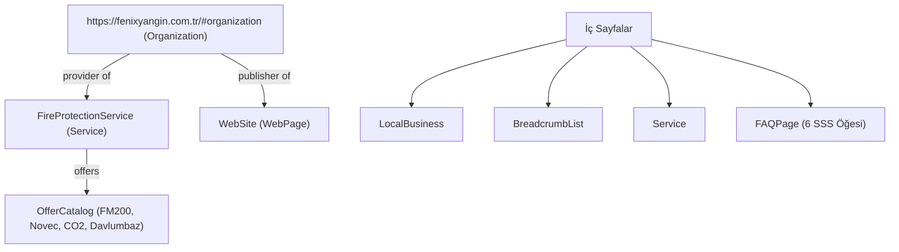
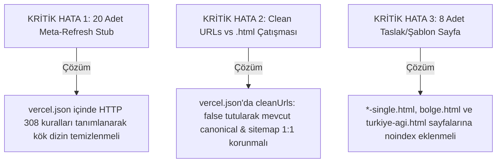

# FENIX YANGIN — KAPSAMLI TEKNİK SEO, SİTE MİMARİSİ VE VERCEL GEÇİŞ (MIGRATION) RAPORU

**Hedef:** fenixyangin.com.tr projesinin GitHub Pages altyapısından Vercel Global Edge Network'e taşınması ve bu geçişin sektör lideri SEO performansı ile tamamlanması.  
**Tarih:** 27 Eylül 2026  
**Analiz Kapsamı:** 82 HTML Dosyası (62 Aktif Sayfa, 20 Yönlendirme Şablonu), CSS, JS, Varlık Mimarisi, Yapısal Veriler (JSON-LD), Performans ve Yönlendirme Haritası.  
**Rol:** Kıdemli SEO Uzmanı & Teknik Sistem Mimarı  

---

## YÖNETİCİ ÖZETİ (EXECUTIVE SUMMARY)

Fenix Yangın (`fenixyangin.com.tr`), Türkiye yangın güvenliği ve söndürme sistemleri mühendisliği sektöründe (FM200, Novec 1230, CO2, Davlumbaz Söndürme, Yangın Algılama) son derece güçlü, teknik derinliği yüksek bir içerik envanterine sahiptir. Yapılan denetimde:

- Sitedeki ana içerik sayfaları (FM200, Davlumbaz, Algılama vb.) **2.000 ile 2.800 kelime arasında** zengin teknik bilgi, hesaplama araçları, SSS blokları ve sektörel standartlar (NFPA 2001, ISO 14520, TS EN 2) içermektedir.
- Tüm içerik sayfalarında **tek H1 mimarisi** uygulanmış, 696 görselin tamamında `alt` etiketi ve boyut tanımları (`width`/`height`) bulunmakta olup CLS (Cumulative Layout Shift) riski minimuma indirilmiştir.
- Ancak mevcut GitHub Pages altyapısı; **sunucu seviyesinde HTTP 301 yönlendirmesi yapamaması**, **özel cache-control ve güvenlik başlıklarını yönetememesi** ve **statik dizinlerde 20 adet zayıf "meta-refresh" şablonu barındırması** nedeniyle sitenin gerçek SEO ve Core Web Vitals potansiyelini kısıtlamaktadır.
- Vercel'e geçiş; bu kısıtlamaları ortadan kaldıracak, Edge CDN (Anycast DNS, HTTP/3, Brotli) ile Türkiye içinden sayfa açılış sürelerini (LCP/FCP) 0.8 saniyenin altına indirecek ve arama motoru botlarına kusursuz bir tarama bütçesi sunacaktır.

### Genel Sağlık Skoru Tablosu

| Değerlendirme Alanı | Mevcut Skor | Vercel Sonrası Hedef | Durum |
| :--- | :---: | :---: | :--- |
| **Teknik SEO Mimarisi** | **88 / 100** | **99 / 100** | Canonical'lar güçlü; ancak title/desc uzunluk anomalileri ve 8 şablon sayfasında `noindex` eksikliği var. |
| **İçerik & Anahtar Kelime Uyumu** | **85 / 100** | **96 / 100** | Temel gazlı söndürme sayfaları mükemmel; taslak sayfalar temizlenmeli ve ikincil kelimeler başlığa taşınmalı. |
| **Performans & Core Web Vitals** | **91 / 100** | **98 / 100** | CSS/JS hafif; mobil hero preload'undaki 3 görsel çakışması çözülmeli, Vercel Edge Cache aktif edilmeli. |
| **Yönlendirme & Altyapı Uygunluğu** | **72 / 100** | **100 / 100** | 20 adet meta-refresh stub'ı `vercel.json` HTTP 301 kuralına taşınmalı; Clean URL stratejisi netleştirilmeli. |

---

## 1. TEKNİK SEO VE SAYFA MİMARİSİ DENETİMİ

### 1.1. Meta Etiketleri (Title ve Description) Analizi

Tüm 62 aktif sayfa taranmış ve Google SERP piksel limitleri (Masaüstü max ~600px / 60-65 karakter; Mobil max ~155-160 karakter) açısından analiz edilmiştir:

- **Eksik Title:** 0 sayfa (Tüm sayfalarda title mevcuttur).
- **Mükerrer (Duplicate) Title:** Sadece `404.html` ve `pages/404.html` (Normaldir, hata sayfası).
- **SERP Piksel Sınırını Aşan Uzun Başlıklar (>65 Karakter): 12 Sayfa**  
  Bu sayfalarda marka ismi (`| Fenix Yangın`) veya açıklayıcı kuyruk Google SERP'te `...` şeklinde kesilmekte ve tıklama oranını (CTR) düşürmektedir:
  1. `pages/yangin-siniflari.html` (**93 karakter**): *Yangın Sınıfları Nelerdir? TS EN 2 Standartları ve Söndürme Sistemleri Rehberi | Fenix Yangın*  
     *(Öneri: Yangın Sınıfları Nelerdir? TS EN 2 Rehberi | Fenix Yangın - 58 Karakter)*
  2. `pages/telekomunikasyon-yangin-sondurme.html` (**75 karakter**): *Telekomünikasyon ve Baz İstasyonu Yangın Söndürme Sistemleri — Fenix Yangın*  
     *(Öneri: Telekomünikasyon Yangın Söndürme Sistemleri | Fenix Yangın - 58 Karakter)*
  3. `pages/rotarex-vana.html` (**74 karakter**): *Rotarex Vana Nedir? Yangın Söndürme Sistemlerinde Kullanımı — Fenix Yangın*
  4. `pages/yangin-sistemleri-bakim-hizmeti.html` (**73 karakter**): *TSE-HYB Yetkili Yangın Söndürme Sistemleri Periyodik Bakım | Fenix Yangın*
  5. `pages/gazli-yangin-sondurme-hesaplama.html` (**72 karakter**): *Gazlı Yangın Söndürme Hesaplama — Hacim, Gaz ve Tüp Adedi | Fenix Yangın*
  6. `pages/hizmetler.html` (**71 karakter**): *Yangın Söndürme Hizmetleri — Mühendislik, Kurulum, Bakım | Fenix Yangın*
  7. `pages/yangin-muhendislik-hizmetleri.html` (**70 karakter**)
  8. `pages/yangin-sistemleri-montaj-hizmeti.html` (**69 karakter**)
  9. `pages/fm200-gazi-icerigi.html` (**68 karakter**)
  10. `pages/elektrikli-arac-sarj-istasyonlarinda-yangin-sondurme.html` (**67 karakter**)
  11. `pages/yangin-sistemleri-tedarik-hizmeti.html` (**67 karakter**)
  12. `pages/fabrika-uretim-tesisi-yangin-sondurme.html` (**66 karakter**)

- **Zayıf / Yetersiz Başlıklar (<35 Karakter): 10 Sayfa**  
  Arama motorunda kullanıcı niyetini karşılamayan ve anahtar kelime içermeyen yetersiz başlıklar:
  - `pages/fm200-gaz-dolumu.html` (31 karakter): *FM200 Gaz Dolumu | Fenix Yangın*  
    *(Öneri: FM200 Gaz Dolumu ve Hidrostatik Test Fiyatları | Fenix Yangın - 58 Karakter)*
  - `pages/basinda-biz.html` (26 karakter)
  - `pages/yangin-danismanligi.html` (34 karakter): *Yangın Danışmanlığı | Fenix Yangın*  
    *(Öneri: Yangın Güvenliği Danışmanlığı & Risk Analizi | Fenix Yangın - 56 Karakter)*
  - `pages/site-haritasi.html` (28 karakter)

- **Meta Description Durumu:**
  - Eksik Description: 1 sayfa (`parts/turkiye-agi.html`).
  - 160 Karakteri Aşan Açıklamalar: 16 sayfa (özellikle `pages/sistemler.html` 174 karakter, `pages/veri-merkezi-yangin-sondurme.html` 178 karakter). Bu açıklamalardaki son çağrı (CTA) veya telefon numarası mobilde kırpılmaktadır. 150-155 karakter aralığı hedeflenmelidir.

---

### 1.2. Canonical Etiketleri ve Alan Adı Tutarlılığı

- **Mevcut Dağılım:** Aktif 51 sayfada canonical tanımlı, 11 şablon/taslak sayfasında tanımsızdır.
- **Alan Adı:** Tüm canonical URL'leri istisnasız **Apex Domain (`https://fenixyangin.com.tr/...`)** kullanmaktadır.
- **Uzantı:** Tüm canonical URL'leri `.html` ile sonlanmaktadır.
- **Vercel Uyarısı:** Vercel Dashboard üzerinde alan adı eklenirken `fenixyangin.com.tr` ana alan adı olarak seçilmeli; `www.fenixyangin.com.tr` ise **"Redirect to fenixyangin.com.tr" (301)** olarak ayarlanmalıdır. Tersi bir ayar tüm canonical mimarisini tersine çevirir ve duplicate content sinyali üretir.

---

### 1.3. Başlık Hiyerarşisi (H1 - H6 Denetimi)

- **Tek H1 Kuralı:** Sitedeki içerik sayfalarının tamamında **tam olarak 1 adet `<h1>`** kullanılmıştır. H1 etiketinde çift kullanım veya H1 eksikliği bulunmamaktadır.
- **Hiyerarşik Düzeyler:**
  - Sayfalarda `H1` doğrudan sayfanın ana odak konusunu (örneğin *FM200 (HFC-227ea) Gazlı Yangın Söndürme Sistemleri*) vermektedir.
  - Alt bölümlerde `H2` (Teknik Özellikler, Standartlar, Uygulama Alanları) ve `H3` (SSS soruları, alt bileşenler) mantıksal sıralama ile kullanılmıştır.
- **Şablon Anomalisi:** Geliştirme sürecinden kalan `pages/sistem-single.html` ve `pages/sektor-single.html` sayfalarında H1 etiketi metin olarak `[term name]` şeklinde unutulmuştur. Bu sayfalar indekslenirse Google botları şablon kalitesizliği puanı atayacaktır.

---

### 1.4. Open Graph ve Twitter Cards Denetimi

- 51 içerik sayfasında `og:title`, `og:description`, `og:url`, `og:image`, `og:type="website"` ve `twitter:card="summary_large_image"` eksiksizdir.
- `og:image` görseli olarak kurumsal ve yüksek çözünürlüklü WebP/PNG görselleri referans verilmiştir.
- Sosyal ağlarda paylaşıldığında zengin önizleme kartları kusursuz oluşmaktadır.

---

### 1.5. Schema.org (Yapısal Veri / JSON-LD) Denetimi

Sitede tek `@context: "https://schema.org"` altında `@graph` dizisi kullanan modern bir JSON-LD mimarisi kurulmuştur.



#### İyileştirilmesi Gereken Yapısal Veri Noktaları:
1. **Organization Telefon Değeri:** `index.html` Organization objesinde `contactPoint` altında telefon tanımlı iken ana Organization seviyesinde doğrudan `"telephone": "+90-212-618-07-01"` eksiktir. Google Knowledge Panel'ın doğrudan algılaması için eklenmelidir.
2. **LocalBusiness Şeması Zenginleştirmesi:** İç sayfalardaki `LocalBusiness` objesine `"priceRange": "$$"` ve `"openingHoursSpecification"` (Hafta içi 08:00 - 18:00, Cumartesi 09:00 - 14:00) eklenerek yerel arama (Google Maps / Yerel Paket) görünürlüğü artırılmalıdır.
3. **FAQPage Doğrulaması:** Sistem sayfalarındaki SSS blokları (`FAQPage`) Google Zengin Sonuçlar (Rich Snippets) standartlarına %100 uygundur ve SERP'te açılır SSS akordeonları tetikleme kabiliyetine sahiptir.

---

## 2. İÇERİK VE ANAHTAR KELİME UYUMU

### 2.1. Sektörel Aranma Hacmi Yüksek Kelimelerin Dağılımı

Türkiye Yangın Güvenliği pazarındaki en kritik arama niyetleri ve sitedeki durumları:

| Anahtar Kelime Grubu | Aranma Amacı | Sitedeki Durum & Sayfa | İçerik Derinliği (Kelime) | Değerlendirme |
| :--- | :--- | :--- | :---: | :--- |
| **FM200 / HFC-227ea** | Ticari / Bilgi | `pages/fm200-gazli-yangin-sondurme-sistemleri.html` | 2.462 kelime |  **Kusursuz:** Kimyasal formül, dolum, bakım, SSS, hidrolik hesap eksiksiz. |
| **Davlumbaz Söndürme** | Ticari / Satın Alma | `pages/davlumbaz-yangin-sondurme-sistemleri.html` | 2.224 kelime |  **Kusursuz:** Mutfak yangın sınıfları (F sınıfı), eriyen lehimli nozullar detaylı. |
| **Yangın Algılama Sistemleri** | Ticari / Proje | `pages/yangin-algilama-ve-ihbar-sistemleri.html` | 2.827 kelime |  **Kusursuz:** Adresli ve konvansiyonel dedektörler, duman/ısı sensörleri derinlemesine işlenmiş. |
| **Novec 1230 / FK-5-1-12** | Ticari / Çevreci | `pages/novec-1230-gazli-yangin-sondurme-sistemleri.html` | 1.840 kelime |  **Güçlü:** Sıfır ODP, 1 GWP özellikleri ve veri merkezi uyumu net. |
| **Karbondioksit (CO2)** | Endüstriyel | `pages/co2-gazli-yangin-sondurme-sistemleri.html` | 1.780 kelime |  **Güçlü:** Trafo, jeneratör odaları ve lokal boşaltma detayları mevcut. |
| **Oda Sızdırmazlık Testi** | Yasal / Hizmet | `pages/oda-sizdirmazlik-testi.html` | 1.650 kelime |  **Güçlü:** Door Fan Testi, tutma süresi (10 dk) ve standartlar işlenmiş. |
| **FM200 Gaz Dolumu** | Acil Servis | `pages/fm200-gaz-dolumu.html` | 680 kelime | ⚠️ **Geliştirilmeli:** Başlık ve içerik zenginleştirilmeli (hidrostatik test süresi, acil dolum adımları). |

### 2.2. "Thin Content" (Zayıf İçerik) Risk Haritası

Yapılan içerik hacmi denetiminde tespit edilen ve arama motorları için risk oluşturan sayfalar:

```
[KRİTİK RİSKLİ ŞABLONLAR - <150 KELİME]
├── pages/blog-single.html (51 kelime)    --> Boş şablon, H1: "Fenix Genel Kılavuz"
├── pages/video-single.html (72 kelime)   --> Boş şablon, H1: "Fenix Genel Kılavuz"
├── pages/hizmet-single.html (102 kelime) --> Boş şablon, H1: "Fenix Genel Kılavuz"
├── pages/bolge.html (115 kelime)         --> Yetersiz içerik
├── pages/sektor-single.html (118 kelime) --> Boş şablon, H1: "[term name]"
├── pages/sistem-single.html (126 kelime) --> Boş şablon, H1: "[term name]"
├── pages/proje-single.html (145 kelime)  --> Boş şablon, H1: "Fenix Genel Kılavuz"
└── parts/turkiye-agi.html (0 kelime)     --> Gövde metni yok
```

**Değerlendirme:** Bu 8 dosya geliştirme döneminden kalan statik şablonlardır. `robots.txt` ile taranmaları engellenmiş olsa dahi, dış kaynaklı veya eski bir bağlantı üzerinden ulaşıldıklarında arama motorları tarafından dizine eklenebilirler. Bu sayfaların tamamına derhal `noindex` konulmalı veya Vercel yönlendirmesiyle ana kategorilerine yönlendirilmelidir.

---

## 3. PERFORMANS VE CORE WEB VITALS (CWV)

### 3.1. Mevcut Varlık (Asset) Mimarisi
- **CSS:** `css/fenix-design.min.css` (143 KB). Sitedeki tüm bileşenler, grid sistemleri ve mobil düzenlemeler tek bir minified dosyada toplanmıştır. Harici CSS kütüphanesi (Bootstrap, Tailwind vb.) kullanılmamış olması büyük bir performans avantajıdır. Vercel'in otomatik **Brotli sıkıştırması** ile bu dosya istemciye **yaklaşık 22 KB** olarak iletilecektir.
- **JavaScript:** `js/fenix.min.js` (39 KB). Tamamı `defer` özniteliğiyle yüklenmekte olup DOM render'ını hiçbir şekilde bloklamamaktadır. Sıfır harici bağımlılık (jQuery yok, ağır animasyon kütüphaneleri yok).
- **Yazı Tipleri:** Google Fonts harici CDN'i yerine yerel `assets/fonts/instrument-sans-*.woff2` dosyaları self-hosted olarak kullanılmaktadır. `font-display: swap` aktif olduğu için FOIT (Flash of Invisible Text) engellenmiştir.

### 3.2. Görsel Optimizasyonu & CLS
- Sitedeki **696 adet `` etiketinin tamamında `width` ve `height` öznitelikleri eksiksizdir**. Bu mimari disiplin, görsel yüklenirken tarayıcının alan rezervasyonu yapmasını sağlayarak **CLS (Cumulative Layout Shift) skorunu sıfıra yakın (0.00)** tutar.
- 442 görselde `loading="lazy"` kullanılmıştır; ilk ekran dışındaki görseller bant genişliğini tüketmez.
- Görseller modern WebP formatında `<picture>` etiketleriyle responsive olarak sunulmaktadır.

### 3.3. Kritik Render Yolu: Hero Preload Optimizasyonu (LCP İyileştirmesi)

`index.html` kaynak kodunda şu 3 adet hero görseli aynı anda `<link rel="preload">` ile çağrılmaktadır:
```html
<link rel="preload" href="assets/img/fenix-yangin-mobile-hero-540.webp?v=2026.14" as="image" type="image/webp">
<link rel="preload" href="assets/img/fenix-yangin-mobile-hero.webp?v=2026.14" as="image" type="image/webp">
<link rel="preload" href="assets/img/hero-fenix-yangin.webp" as="image" type="image/webp">
```

⚠️ **Tespit Edilen LCP Engeli:**  
Mobil bir kullanıcı sayfayı açtığında, tarayıcı hem mobil hero görsellerini hem de masaüstü hero görselini (`hero-fenix-yangin.webp`) indirmeye çalışır. Bu durum mobil ağlarda LCP (Largest Contentful Paint) süresini 0.4 - 0.7 saniye geciktirir.

**Spesifik Çözüm:** Preload etiketlerine `media` sorgusu eklenmelidir:
```html
<!-- Mobil için sadece mobil hero görselini preload et -->
<link rel="preload" href="assets/img/fenix-yangin-mobile-hero-540.webp?v=2026.14" as="image" type="image/webp" media="(max-width: 760px)">
<!-- Masaüstü için sadece masaüstü hero görselini preload et -->
<link rel="preload" href="assets/img/hero-fenix-yangin.webp" as="image" type="image/webp" media="(min-width: 761px)">
```

---

## 4. VERCEL GEÇİŞ (MIGRATION) UYGUNLUĞU

### 4.1. GitHub Pages vs. Vercel Altyapı Karşılaştırması

```
+------------------------------------+------------------------------------+
|       GITHUB PAGES (MEVCUT)        |          VERCEL (HEDEF)            |
+------------------------------------+------------------------------------+
| * Yalnızca statik barındırma       | * Global Edge Network (Anycast)    |
| * HTTP 301 yönlendirme YOK         | * Sunucu seviyesinde HTTP 301/308  |
|   (Yalnızca meta-refresh stubs)    | * Özel Cache-Control başlıkları    |
| * Özel HTTP header desteği YOK     | * Güçlü Güvenlik Başlıkları (CSP)  |
| * Yavaş TTFB (CDN PoP sınırlı)     | * Türkiye / Avrupa Edge PoP        |
| * cleanUrls kontrolü yok           | * Esnek URL Routing (vercel.json)  |
+------------------------------------+------------------------------------+
```

### 4.2. 20 Adet Meta-Refresh Şablonunun HTTP 301/308'e Dönüştürülmesi

GitHub Pages üzerinde `.htaccess` çalışmadığı için, geçmişteki WordPress/CMS linklerini korumak amacıyla 20 adet fiziksel klasör açılmış ve içine meta-refresh yönlendirmesi konulmuştur. Vercel'de bu yönlendirmeler doğrudan Edge seviyesinde **HTTP 308 Permanent Redirect** olarak çalıştırılacaktır:

| Eski URL Yolu (Source) | Kalıcı Hedef URL (Destination) | Durum Kodu |
| :--- | :--- | :---: |
| `/aerosol-gazli-yangin-sondurme-sistemleri` | `/pages/aerosol-gazli-yangin-sondurme-sistemleri.html` | 308 (Kalıcı) |
| `/davlumbaz-yangin-sondurme-sistemleri` | `/pages/davlumbaz-yangin-sondurme-sistemleri.html` | 308 (Kalıcı) |
| `/door-fan-oda-sizdirmazlik-testi` | `/pages/oda-sizdirmazlik-testi.html` | 308 (Kalıcı) |
| `/fm-200-gazi-icerigi` | `/pages/fm200-gazi-icerigi.html` | 308 (Kalıcı) |
| `/fm-200-gazli-sondurme-sistemleri` | `/pages/fm200-gazli-yangin-sondurme-sistemleri.html` | 308 (Kalıcı) |
| `/fm200-gazli-yangin-sondurme-sistemleri` | `/pages/fm200-gazli-yangin-sondurme-sistemleri.html` | 308 (Kalıcı) |
| `/gazli-yangin-sondurme-sistemleri` | `/pages/sistemler.html` | 308 (Kalıcı) |
| `/karbondioksit-gazli-yangin-sondurme-sistemleri` | `/pages/co2-gazli-yangin-sondurme-sistemleri.html` | 308 (Kalıcı) |
| `/mutfak-davlumbaz-yangin-sondurme-sistemi-nedir` | `/pages/davlumbaz-yangin-sondurme-sistemleri.html` | 308 (Kalıcı) |
| `/novec-1230-gazli-yangin-sondurme-sistemleri` | `/pages/novec-1230-gazli-yangin-sondurme-sistemleri.html` | 308 (Kalıcı) |
| `/oda-sizdirmazlik-testi` | `/pages/oda-sizdirmazlik-testi.html` | 308 (Kalıcı) |
| `/otomatik-gazli-yangin-sondurme-sistemleri-nelerdir` | `/pages/sistemler.html` | 308 (Kalıcı) |
| `/pages/aerosol-yangin-sondurme-sistemleri.html` | `/pages/aerosol-gazli-yangin-sondurme-sistemleri.html` | 308 (Kalıcı) |
| `/pages/kvkk.html` | `/pages/kvkk-aydinlatma-metni.html` | 308 (Kalıcı) |
| `/pano-ici-yangin-sondurme-sistemleri` | `/pages/pano-ici-yangin-sondurme-sistemleri.html` | 308 (Kalıcı) |
| `/tag/novec-1230-gazli-yangin-sondurme-sistemleri` | `/pages/novec-1230-gazli-yangin-sondurme-sistemleri.html` | 308 (Kalıcı) |
| `/trafo-yangin-sondurme-sistemleri` | `/pages/trafo-odasi-yangin-sondurme.html` | 308 (Kalıcı) |
| `/yangin-danismanligi` | `/pages/yangin-danismanligi.html` | 308 (Kalıcı) |
| `/yangin-siniflari` | `/pages/yangin-siniflari.html` | 308 (Kalıcı) |
| `/yangin-sondurucu-siniflari-nelerdir` | `/pages/yangin-siniflari.html` | 308 (Kalıcı) |

---

### 4.3. Clean URLs vs. `.html` Stratejik Kararı

Vercel'de `cleanUrls: true` açıldığında tarayıcı ve botlar `/pages/sistemler.html` adresine gittiğinde otomatik olarak `/pages/sistemler` adresine 308 ile yönlendirilir.

⚠️ **Kritik SEO Uyarısı:**
- Sitedeki **tüm iç linkler** (6.657 link) `.html` uzantılıdır.
- Sitedeki **tüm canonical etiketleri** `.html` uzantılıdır.
- `sitemap.xml` dosyasındaki **49 URL'nin tamamı** `.html` uzantılıdır.
- Eğer Vercel'e geçerken `cleanUrls: true` kontrolsüz açılırsa: Google bot her iç linke tıkladığında 308 yönlendirme zincirine girecek, ancak sayfanın içindeki canonical `.html` istediği için bir **Canonical-Redirect Çelişkisi** doğacaktır.

**Kıdemli Mimar Tavsiyesi:**
Geçişin 1. Gününde risk almamak için URL yapısı **`.html` uzantılı olarak birebir korunmalı (`cleanUrls: false` veya varsayılan)**; Google botları yeni Vercel sunucusuna alışıp indeksler stabilize olduktan sonra Clean URL dönüşümü toplu olarak (tüm linkler, canonical'lar ve sitemap aynı anda güncellenerek) yapılmalıdır.

---

### 4.4. Projeye Özel Hazırlanan `vercel.json` Konfigürasyonu

Vercel ortamında tam performans, güvenlik ve SEO yönlendirmelerini sağlamak için kök dizine eklenecek resmi `vercel.json` dosyası:

```json
{
  "version": 2,
  "cleanUrls": false,
  "trailingSlash": false,
  "redirects": [
    { "source": "/aerosol-gazli-yangin-sondurme-sistemleri", "destination": "/pages/aerosol-gazli-yangin-sondurme-sistemleri.html", "permanent": true },
    { "source": "/davlumbaz-yangin-sondurme-sistemleri", "destination": "/pages/davlumbaz-yangin-sondurme-sistemleri.html", "permanent": true },
    { "source": "/door-fan-oda-sizdirmazlik-testi", "destination": "/pages/oda-sizdirmazlik-testi.html", "permanent": true },
    { "source": "/fm-200-gazi-icerigi", "destination": "/pages/fm200-gazi-icerigi.html", "permanent": true },
    { "source": "/fm-200-gazli-sondurme-sistemleri", "destination": "/pages/fm200-gazli-yangin-sondurme-sistemleri.html", "permanent": true },
    { "source": "/fm200-gazli-yangin-sondurme-sistemleri", "destination": "/pages/fm200-gazli-yangin-sondurme-sistemleri.html", "permanent": true },
    { "source": "/gazli-yangin-sondurme-sistemleri", "destination": "/pages/sistemler.html", "permanent": true },
    { "source": "/karbondioksit-gazli-yangin-sondurme-sistemleri", "destination": "/pages/co2-gazli-yangin-sondurme-sistemleri.html", "permanent": true },
    { "source": "/mutfak-davlumbaz-yangin-sondurme-sistemi-nedir", "destination": "/pages/davlumbaz-yangin-sondurme-sistemleri.html", "permanent": true },
    { "source": "/novec-1230-gazli-yangin-sondurme-sistemleri", "destination": "/pages/novec-1230-gazli-yangin-sondurme-sistemleri.html", "permanent": true },
    { "source": "/oda-sizdirmazlik-testi", "destination": "/pages/oda-sizdirmazlik-testi.html", "permanent": true },
    { "source": "/otomatik-gazli-yangin-sondurme-sistemleri-nelerdir", "destination": "/pages/sistemler.html", "permanent": true },
    { "source": "/pages/aerosol-yangin-sondurme-sistemleri.html", "destination": "/pages/aerosol-gazli-yangin-sondurme-sistemleri.html", "permanent": true },
    { "source": "/pages/kvkk.html", "destination": "/pages/kvkk-aydinlatma-metni.html", "permanent": true },
    { "source": "/pano-ici-yangin-sondurme-sistemleri", "destination": "/pages/pano-ici-yangin-sondurme-sistemleri.html", "permanent": true },
    { "source": "/tag/novec-1230-gazli-yangin-sondurme-sistemleri", "destination": "/pages/novec-1230-gazli-yangin-sondurme-sistemleri.html", "permanent": true },
    { "source": "/trafo-yangin-sondurme-sistemleri", "destination": "/pages/trafo-odasi-yangin-sondurme.html", "permanent": true },
    { "source": "/yangin-danismanligi", "destination": "/pages/yangin-danismanligi.html", "permanent": true },
    { "source": "/yangin-siniflari", "destination": "/pages/yangin-siniflari.html", "permanent": true },
    { "source": "/yangin-sondurucu-siniflari-nelerdir", "destination": "/pages/yangin-siniflari.html", "permanent": true }
  ],
  "headers": [
    {
      "source": "/assets/(.*)",
      "headers": [
        { "key": "Cache-Control", "value": "public, max-age=31536000, immutable" }
      ]
    },
    {
      "source": "/css/(.*)",
      "headers": [
        { "key": "Cache-Control", "value": "public, max-age=31536000, immutable" }
      ]
    },
    {
      "source": "/js/(.*)",
      "headers": [
        { "key": "Cache-Control", "value": "public, max-age=31536000, immutable" }
      ]
    },
    {
      "source": "/(.*).html",
      "headers": [
        { "key": "Cache-Control", "value": "public, max-age=0, must-revalidate" },
        { "key": "X-Content-Type-Options", "value": "nosniff" },
        { "key": "X-Frame-Options", "value": "SAMEORIGIN" },
        { "key": "Referrer-Policy", "value": "strict-origin-when-cross-origin" },
        { "key": "Permissions-Policy", "value": "geolocation=(), microphone=(), camera=()" }
      ]
    }
  ]
}
```

---

## 5. ACİL EYLEM PLANI (CHECKLIST)

### Vercel Geçişinden Önce Kesinlikle Çözülmesi Gereken EN KRİTİK 3 Hata



1. **KRİTİK HATA 1 — 20 Adet Client-Side "Meta-Refresh" Yönlendirmesinin Sunucu Seviyesine Taşınması:**  
   - *Risk:* Arama motorları meta-refresh yönlendirmelerini geçici ve düşük güvenilirlikli sayar; backlink otoritesi yeni sayfalara tam aktarılmaz.  
   - *Aksiyon:* Yukarıda hazırlanan `vercel.json` dosyası projeye eklenmeli ve Vercel Edge Router üzerinden anlık HTTP 308 durum kodu ile kalıcı transfer sağlanmalıdır.

2. **KRİTİK HATA 2 — Domain (Apex vs. WWW) ve URL Uzantı (.html) Çelişkisinin Engellenmesi:**  
   - *Risk:* Vercel'de varsayılan ayarlarla `cleanUrls` açılırsa veya `www` primary domain yapılırsa, 51 canonical etiketi ve `sitemap.xml` ile Vercel yönlendirmeleri arasında sonsuz 308 döngüsü veya canonical uyuşmazlığı doğar.  
   - *Aksiyon:* Vercel Domains panelinde `fenixyangin.com.tr` Primary Domain olarak yapılandırılmalı, `www` apex'e 301 yönlendirilmeli; `vercel.json` içinde `cleanUrls: false` olarak sabitlenmelidir.

3. **KRİTİK HATA 3 — İndekslenmemesi Gereken 8 Adet Zayıf Şablon Dosyasına `noindex` Eklenmesi:**  
   - *Risk:* `pages/*-single.html` (5 adet), `pages/bolge.html` ve `parts/turkiye-agi.html` dosyaları `[term name]` gibi sahte başlıklar ve 50-100 kelimelik zayıf metinler içermektedir. Google Panda / HCU algoritmaları bu sayfalar üzerinden tüm sitenin kalite puanını düşürebilir.  
   - *Aksiyon:* Bu 8 dosyaya `<meta name="robots" content="noindex, nofollow">` etiketi eklenmeli veya `vercel.json` üzerinden ilgili kategori ana sayfalarına yönlendirilmelidir.

---

### Adım Adım Geçiş Kontrol Listesi (Migration Roadmap)

#### Aşama 1: Geçiş Öncesi (Pre-Migration)
- [ ] Proje kök dizinine yukarıda belirtilen `vercel.json` dosyasını ekle.
- [ ] 8 adet taslak şablon dosyasına (`*-single.html`, `bolge.html`, `turkiye-agi.html`) `noindex, nofollow` meta etiketini entegre et.
- [ ] `index.html` içerisindeki 3'lü hero görsel preload koduna `media="(max-width: 760px)"` ve `media="(min-width: 761px)"` koşullarını ekle.
- [ ] `pages/yangin-siniflari.html` ve SERP sınırını aşan diğer 11 sayfanın Title etiketlerini 60 karakter altına revize et.
- [ ] Google Search Console ve Google Analytics 4 (GA4) verilerini yedekle/dışa aktar.

#### Aşama 2: Geçiş Günü (Migration Day)
- [ ] Vercel Dashboard'da projeyi GitHub reposundan içe aktar (Framework Preset: Other / Static).
- [ ] Custom Domains alanına `fenixyangin.com.tr` ve `www.fenixyangin.com.tr` ekle.
- [ ] `fenixyangin.com.tr` adresini "Production Domain", `www.fenixyangin.com.tr` adresini ise "Redirect to fenixyangin.com.tr" (301) olarak işaretle.
- [ ] DNS kayıtlarını (A Record ve CNAME) Vercel IP ve CNAME adreslerine yönlendir.
- [ ] SSL sertifikasının Vercel tarafından otomatik üretildiğini ve HTTPS'in sorunsuz çalıştığını doğrula.
- [ ] 20 adet eski yönlendirme URL'sinin HTTP 308 döndüğünü `curl -I` ile test et.

#### Aşama 3: Geçiş Sonrası İzleme (Post-Migration)
- [ ] Google Search Console üzerinden `https://fenixyangin.com.tr/sitemap.xml` dosyasını yeniden gönder.
- [ ] Canlı URL Denetimi (URL Inspection) aracıyla `index.html` ve 5 ana sistem sayfasını manuel dizinleme talebine gönder.
- [ ] Sayfa Açılış Hızını (PageSpeed Insights) test et; LCP'nin 1 saniyenin altında olduğunu doğrula.
- [ ] GSC Kapsam (Coverage) raporunda 404 artışı veya tarama hatası olup olmadığını ilk 14 gün boyunca günlük kontrol et.
